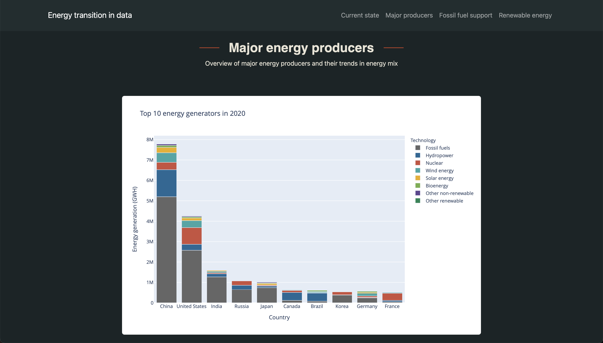

# Energy transition in data

## Description
This project features an informative website designed to provide insights into the global energy transition. Using HTML and CSS, the website visualizes data on energy sources, fossil fuel dependence, and renewable energy trends through interactive graphs and informative content.

## Preview

## Live Site
Explore the website live at [Energy transition in data](https://tomhtlnd.github.io/energy-transition-in-data/).
